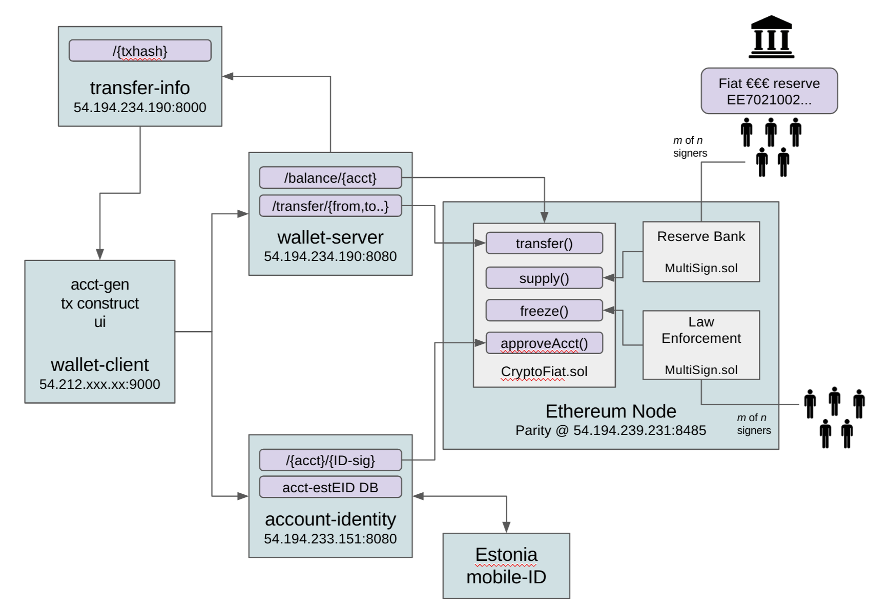

# Cryptofiat monetary system

The blockchain tokens issued in the contract are to be backed by an equal amount of fiat currency, held by a **traditional depository institution** - e.g. a central bank. See the Reserve Bank role.

Only externally approved ethereum accounts are able to transfer tokens in the scheme. The accounts are to be approved for real world individuals, groups or businesses, who have passed sufficient **identity verfication** as required by the law enforcement and legistlation in the Reserve Bank's jurisdiction. The accounts on blockchain remain publicly anonymous, while the law enforcement will have a private mapping between the public crypto accounts and the real world identities. See the Account Approver role.

As all transactions on ethereum always require "gas" cost to be paid by the sender in the ETH currency,  the `delegatedTransfer()` allows a transfer signed by the account holder to be passed to a middleman, e.g. wallet-server, which charges a transaction fee in the cryptofiat token currency and in turn provides the ether required to cover the gas cost when submitting the transfer to the ethereum contract. 

Some account holders will expect a way to **recover money** on their account if they lose the keys to it or forget encryption passwords. For this  purporse, each accountholder can appoint an other account or contract with an ability to copy the tokens from his account to the next. It could be a group of friends in an m-of-n multisignature contract, or it may be an automated government  agency service based on ID.

To preserve the public anonymity of the account holders, the transfers are submitted to the blockchain without any **references, sender or receiver names**. Instead the user applications are expected to submit the accompanying metadata to a dedicated server, encrypted with the public keys of the recipient address.

## Estonia EUR Implementation

* Ethereum [contract v 0.41] (https://etherscan.io/tx/0x27374f4e6a21881a03731fc583d9692a39e3c575e5100d6fd56ab92a8f61e898) [(src)] (github.com/) - works functionally, backed by real EUR on reserve account
* account-identity 54.194.233.151:8080 - approves accounts based on Estonia mobile-ID test certs
* wallet-server 54.194.234.190:8080 - reference implementation - delegated Transfers not functional
* wallet-client :9000 - reference implementation - not functional
* transfer-info 54.194.234.190:8000/ - for storing payment references, sender name, etc (not used yet)
* parity node :8545 - provides a JSON RPC to ethereum for wallet-server and account-identity

## How to use it

1. Generate a new account in wallet-client
2. Get the account approved with account-identity using m-ID
3. Other people with positive EUR balances can now send your account EUR
4. Use wallet-server to send EUR to other approved accounts
5. If you have enough ETH on the account to pay for gas, you can transfer EUR directly from any ethereum client
6. Use the Reserve Bank to convert your EUR on ethereum back to traditional bank-EUR

## Appointed roles

For all practical purposes, some functionality of the monetary system relies on real world roles.

###Reserve Bank
This institution is expected to hold the real world reserve backing the token currency and act as a final exchange. They should always be able to pay out real world currency in exchange to the tokens. The contract functions are used to reflect the change in ethereum if real world reserve is either increased or decresed. The role has an override to change other role appointments to recover accounts when keys are lost. Should be a multisignature contract.
* increaseSupply(amount)
* decreaseSupply(amount)

###Account Approver
A real world institution or an automated service maintained by this institution, which whitelists accounts in the scheme. The Estonian implementation verifies a digital ID card signature. See the documentation.
* approve(account)

###Law Enforcement
Police, courts and possibly other government enforcement agencies need to have the ability to freeze accounts and seize funds. The appointed role is likely a multisignature contract, which can be used to protect against corrupted real world actors.
* enforcedWithdraw(seized_account)
* freeze(account)
* unfreeze(account)

###Enforcement Account Designator

This role can set the destination of where the appointed law enforcers can seize tokens to. The rationale is to avoid law enforces have access to the funds captured. The real world equivalent would be the court's bank account.

###Recovery Account

Is set individually by an account holder and may be any account - either a group of friends, a trusted accountholder, a government agency or any 3rd party. 

## Building contract locally
* Have nodejs with npm
 * `brew install node`
* have [solc](http://solidity.readthedocs.io/en/latest/installing-solidity.html)
 * `npm install solc`
* Build it!
 * `node build.js`
